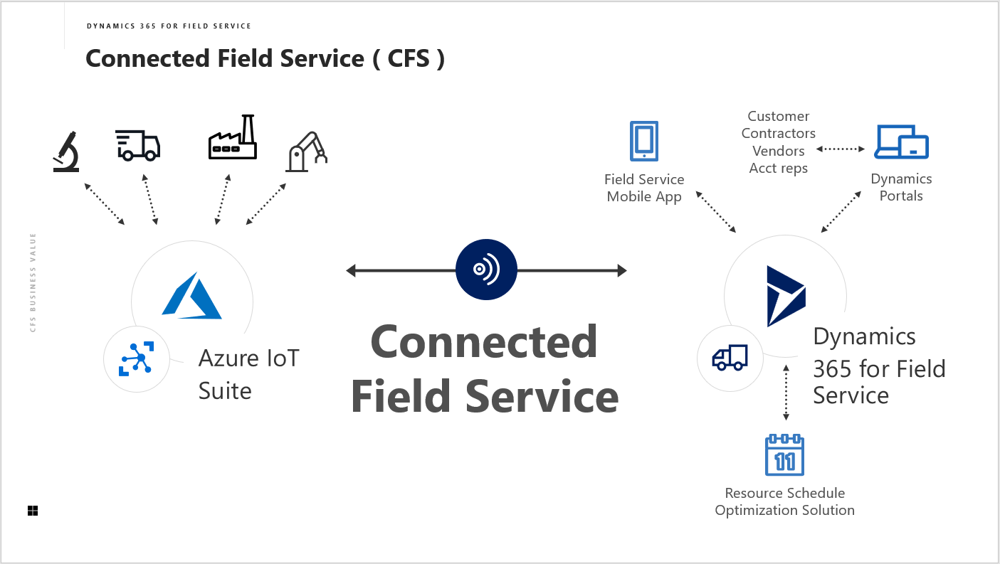

# Dynamics 365 Connected Field Service
The goal of this repo is to give you everything you need to set up a Connected Field Service (CFS) Environment. using both the first timer recommended [CFS Add-on](https://appsource.microsoft.com/en-us/product/dynamics-365/mscrm.58666c7d-65ee-452d-8708-70b4d471d4c0) and more advanced customizations through technical decomposition.

# References
- [Business Application Platform](https://dynamics.microsoft.com/en-us/business-application-platform/)
- [Connected Field Service Add-On](https://appsource.microsoft.com/en-us/product/dynamics-365/mscrm.58666c7d-65ee-452d-8708-70b4d471d4c0)
- [Connected Field Service Architecture](https://docs.microsoft.com/en-us/dynamics365/customer-engagement/field-service/developer/connected-field-service-architecture)
- [MX Chip with VS Code Setup](https://docs.microsoft.com/en-us/azure/iot-hub/iot-hub-arduino-iot-devkit-az3166-get-started)
- [GitHub icons](https://gist.github.com/rxaviers/7360908)
