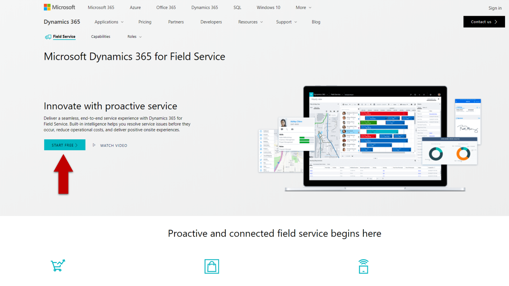

# Intro to Dynamics 365 Connected Field Service
---
The goal of this repo is to give you everything you need to set up a Connected Field Service (CFS) Environment. using both the first timer recommended [CFS](https://appsource.microsoft.com/en-us/product/dynamics-365/mscrm.58666c7d-65ee-452d-8708-70b4d471d4c0) and more advanced custom Azure deployment.

# Goals
| 

 [1. Provision Dynamics 365](Assets/HoloToolkit/Input/README.md) | 

 [2. Provision Azure Trail](Assets/HoloToolkit/Sharing/README.md) | 

 [3. Setup MX Chip](Assets/HoloToolkit/SpatialMapping/README.md) |
| :- | :- | :- |
| `{ blurb here }` | `{ blurb here }` | `{ blurb here }` |
| 

 [4. Setup MX Chip](Assets/HoloToolkit/SpatialMapping/README.md) | 

 [5. Configure Connect Field Service Add-On](Assets/HoloToolkit/SpatialUnderstanding/README.md) | 

 [6. Write Your First App](Assets/HoloToolkit/SpatialUnderstanding/README.md) |
| `{ blurb here }` | `{ blurb here }` | `{ blurb here }` |

## Finished Product
`{ .gif goes here }`

## Step 1: Provision Dynamics 365

1.	From a Web Browser on your computer, visit the [Dynamics 365 for Field Service home page](https://www.microsoft.com/en-us/dynamics365/field-service.png)

2.	Click Try It GREG- redirects you to the overview page where you must click “Start Free” and might want to direct partner to use the trail for development purposes?
Prefer take the P20 approach and give the workshops attendees access to a dummy account in CRM so they can avoid the CRM setup?? But need to verify if multiple account approach does not have implications, naming and login issues
Prereq is to have the attendees config their environments

3.	Fill Out Form  GREG- revise lab with additional screenshots

4.	Click Just One More Step
5.	Fill Out Form

6.	Click Create My Account

7.	Enter Your Phone Number

8.	Click Text Me

9.	Enter Your Validation Code You Received

10.	NOTE: Sometimes the login prompt is being shown directly after this step.
Please log-in the newly created user using the User ID created on the previous step (for example, admin@XXXX.onmicrosoft.com)
NOTE: If the log-in screen fails with a message that the user can’t be found in the system, please wait for a few seconds and try to login again

11.	Click Next

12.	Write Down Your Organization Name and Administrator Username and Password

13.	Click Set up. NOTE: Login invitation might appear on this step as well, please login using your newly created account

14.	Select Field Service

15.	Click Complete Setup

16.	Click Settings

17.	Click Security

18.	Click Users

19.	Click on Your User Name

20.	On the Command Ribbon, Click Promote to Admin

## Step 2: Provision Azure Trial

## Step 3: Setup MX Chip

## Step 4: Configure Connected Field Service

## Step 5: Write Your First Application

## Step 6: Configure Azure IoT Hub Integration

## My Environment
`{ my dynamics and azure environment details }`

# References
- [Connected Field Service Add-On](https://appsource.microsoft.com/en-us/product/dynamics-365/mscrm.58666c7d-65ee-452d-8708-70b4d471d4c0)
- [Connected Field Service Architecture](https://docs.microsoft.com/en-us/dynamics365/customer-engagement/field-service/developer/connected-field-service-architecture)
- [GitHub icons](https://gist.github.com/rxaviers/7360908)
