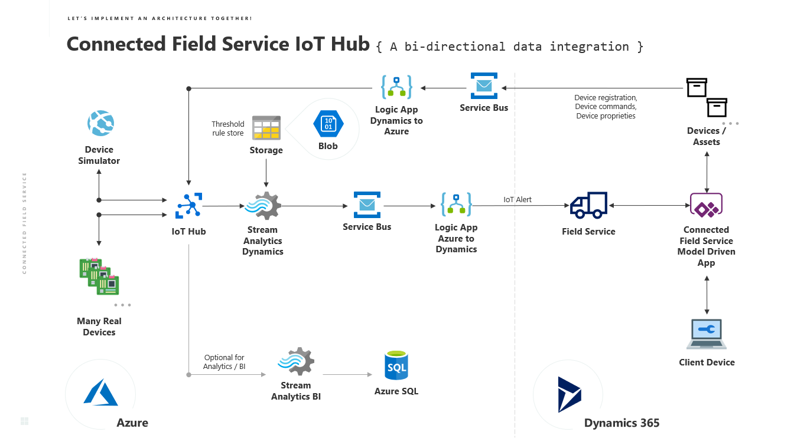
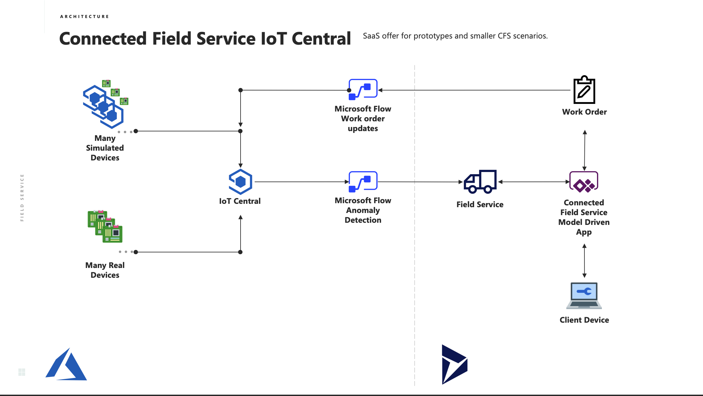

## Azure IoT Hub

## Azure IoT Central

# Dynamics 365 Connected Field Service
The goal of this repo is to give you everything you need to set up a Connected Field Service ( CFS ) Environment. using both the first timer recommended [CFS Add-on](https://appsource.microsoft.com/en-us/product/dynamics-365/mscrm.58666c7d-65ee-452d-8708-70b4d471d4c0) and more advanced customizations deploying the above architecture from scratch on Azure and Dynamics.

# Documentation

All docs are found in the **Connected Field Service.pdf** file.

# Labs

In the Labs folder you'll find 4 exercises walking through how to deploy CFS.

**IN PROGRESS** Lab 5 details how to connect and IoT device to CFS and is **IN PROGRESS**.

# References
- Connected Field Service
    - [Business Application Platform](https://dynamics.microsoft.com/en-us/business-application-platform/)
    - [Connected Field Service Add-On](https://appsource.microsoft.com/en-us/product/dynamics-365/mscrm.58666c7d-65ee-452d-8708-70b4d471d4c0)
    - [Connected Field Service Architecture](https://docs.microsoft.com/en-us/dynamics365/customer-engagement/field-service/developer/connected-field-service-architecture)
    - [MX Chip with VS Code Setup](https://docs.microsoft.com/en-us/azure/iot-hub/iot-hub-arduino-iot-devkit-az3166-get-started)

- Icons
    - [GitHub icons](https://gist.github.com/rxaviers/7360908)
