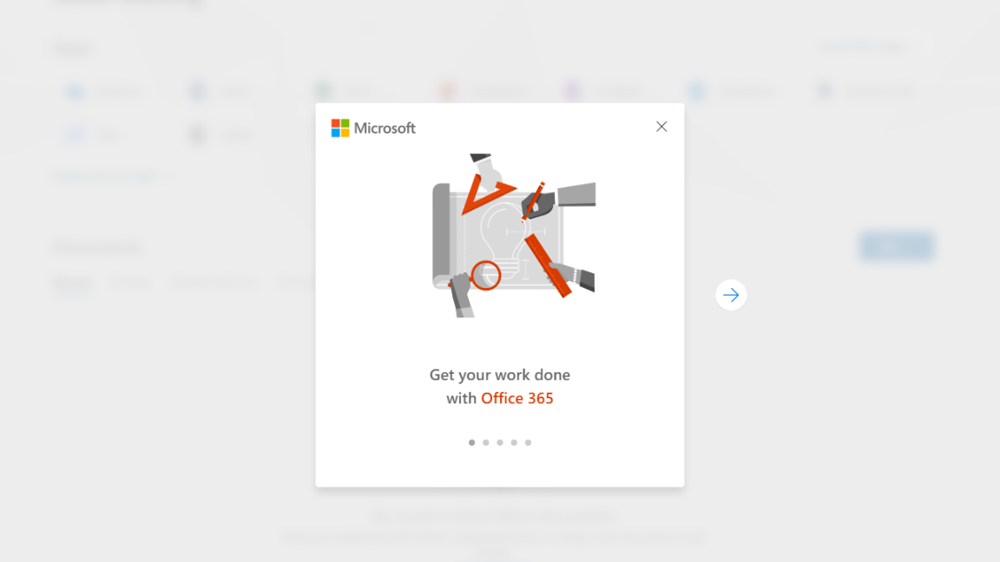
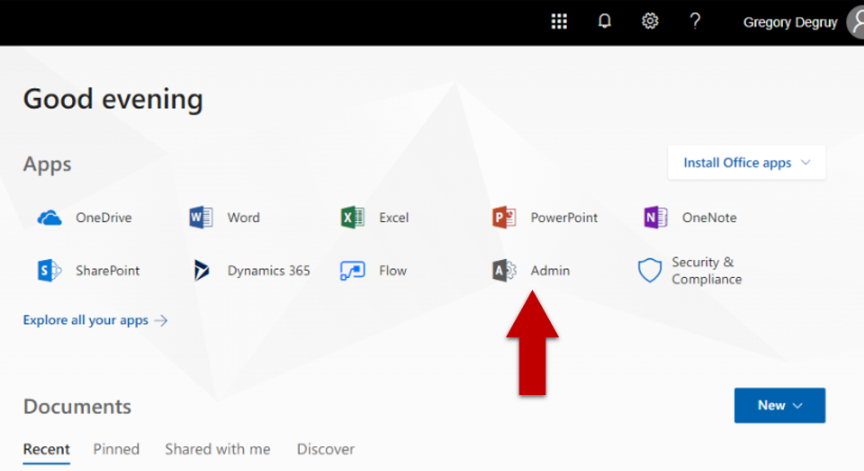
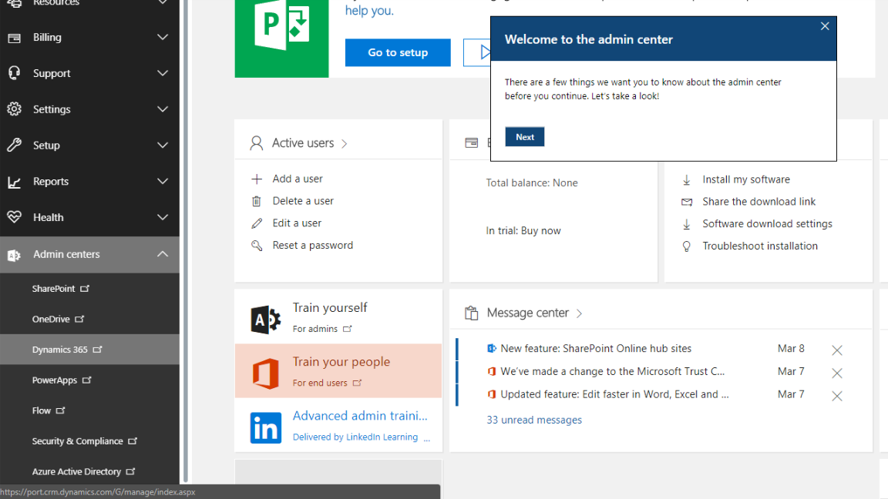

# Intro to Dynamics 365 Connected Field Service
---
The goal of this repo is to give you everything you need to set up a Connected Field Service (CFS) Environment. using both the first timer recommended [CFS](https://appsource.microsoft.com/en-us/product/dynamics-365/mscrm.58666c7d-65ee-452d-8708-70b4d471d4c0) and more advanced custom Azure deployment.

# Goals
| 

 [1. Provision Dynamics 365](Assets/HoloToolkit/Input/README.md) | 

 [2. Provision Azure Trail](Assets/HoloToolkit/Sharing/README.md) | 

 [3. Setup MX Chip](Assets/HoloToolkit/SpatialMapping/README.md) |
| :- | :- | :- |
| `{ blurb here }` | `{ blurb here }` | `{ blurb here }` |
| 

 [4. Setup MX Chip](Assets/HoloToolkit/SpatialMapping/README.md) | 

 [5. Configure Connect Field Service Add-On](Assets/HoloToolkit/SpatialUnderstanding/README.md) | 

 [6. Write Your First App](Assets/HoloToolkit/SpatialUnderstanding/README.md) |
| `{ blurb here }` | `{ blurb here }` | `{ blurb here }` |

## Finished Product
`{ .gif goes here }`

## Step 1: Provision Dynamics 365

1.	From a Web Browser on your computer, visit the [Dynamics 365 for Field Service home page](https://www.microsoft.com/en-us/dynamics365/field-service) and click the `START FREE >` button.

  

2. Start your digital transformation!
  - `A` Select the Field Service app if it is not selected already
  - `B` Click `Sign up here`

    

    > IMPORTANT
    >
    > Do not fill out work email and phone number and Do not click `GET STARTED >`

3. Next you'll be naviagted to provision your new Dynamics Trail. Fill out the general information about yourself and your company then click `Next`.

  

4. Enter your user ID information and click `Create my account`.

  

5. Lastly you'll have to confirm your identity using your phone, enter your phone number and click `Text me ->`.

  

6. After phone authentication is complete, you'll be given some important URLS that you should note down while the signup is finishing. Once the signup is finished click the `Set up` that appears.

  

  > NOTE
  >
  > Keep the "Sign-in page" and "user ID" copied somewhere on your computer like a text file, you will need this information later.

7.	Now you should be on the Dynamics 365 FREE 30 Trial set up page.
  - `A` Field service should already be checked, if not make sure to click the check box.
  - `B` Click `Complete Setup`, A "Setting Up..." alert will appear.
  - `C` After the setup is complete you'll get another alert letting you know your Trial Organization will be ready soon!

    

    

8. Head over to the [Office Sign-in page](https://portal.office.com/) from step 6 by clicking on [https://portal.office.com/](https://portal.office.com/) and log in with your user ID information from step 4. You'll first see a welcome alert, go ahead and hit the `X` button to remove it and then click the Admin app.

  

  

9. Now you should be on the Office admin page.
  - `A` You'll first see a welcome alert, go ahead and hit the `X` button to remove it
  - `B` On the left menu click `Dynamics 365`, a new tab will open

  

10.	Click Settings

11.	Click Security

12.	Click Users

13.	Click on Your User Name

14.	On the Command Ribbon, Click Promote to Admin

## Step 2: Provision Azure Trial

## Step 3: Setup MX Chip

## Step 4: Configure Connected Field Service

## Step 5: Write Your First Application

## Step 6: Configure Azure IoT Hub Integration

## My Environment
`{ my dynamics and azure environment details }`

# References
- [Connected Field Service Add-On](https://appsource.microsoft.com/en-us/product/dynamics-365/mscrm.58666c7d-65ee-452d-8708-70b4d471d4c0)
- [Connected Field Service Architecture](https://docs.microsoft.com/en-us/dynamics365/customer-engagement/field-service/developer/connected-field-service-architecture)
- [GitHub icons](https://gist.github.com/rxaviers/7360908)
