# Intro to Dynamics 365 Connected Field Service
---
The goal of this repo is to give you everything you need to set up a Connected Field Service (CFS) Environment. using both the first timer recommended [CFS](https://appsource.microsoft.com/en-us/product/dynamics-365/mscrm.58666c7d-65ee-452d-8708-70b4d471d4c0) and more advanced custom Azure deployment.

# Goals
| 

 [1. Provision Dynamics 365](Assets/HoloToolkit/Input/README.md) | 

 [2. Provision Azure Trail](Assets/HoloToolkit/Sharing/README.md) | 

 [3. Setup MX Chip](Assets/HoloToolkit/SpatialMapping/README.md) |
| :- | :- | :- |
| `{ blurb here }` | `{ blurb here }` | `{ blurb here }` |
| 

 [4. Setup MX Chip](Assets/HoloToolkit/SpatialMapping/README.md) | 

 [5. Technical decomposition](Assets/HoloToolkit/SpatialUnderstanding/README.md) | 

 [6. Something else](Assets/HoloToolkit/SpatialUnderstanding/README.md) |
| `{ blurb here }` | `{ blurb here }` | `{ blurb here }` |

## Finished Product
`{ .gif goes here }`

## Exercise 1: Provision Dynamics 365

1.	From a Web Browser on your computer, visit the [Dynamics 365 for Field Service home page](https://www.microsoft.com/en-us/dynamics365/field-service) and click the `START FREE >` button.

  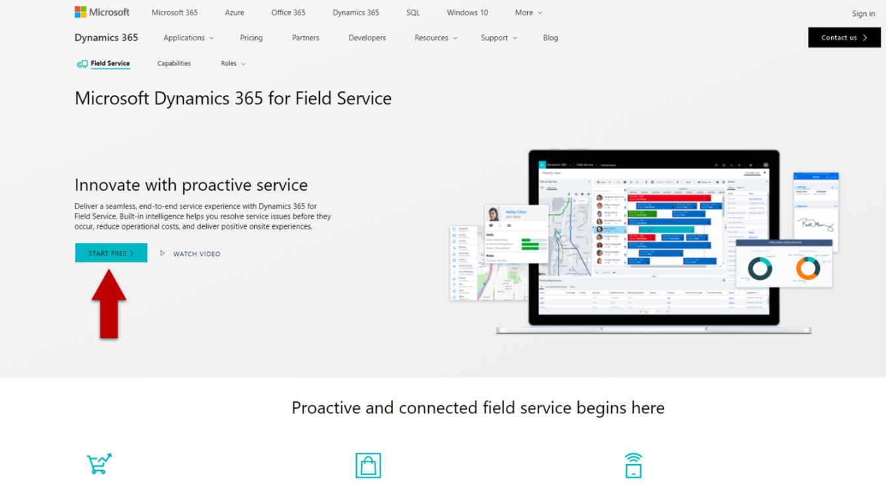

2. Start your digital transformation!
  - `A` Select the Field Service app if it is not selected already
  - `B` Click `Sign up here`

    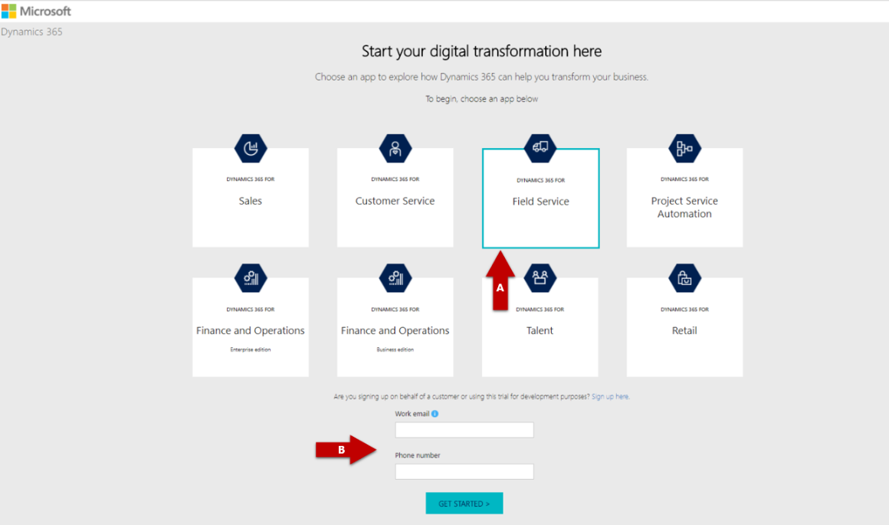

    > IMPORTANT
    >
    > Do not fill out work email and phone number and Do not click `GET STARTED >`

3. Next you'll be naviagted to provision your new Dynamics Trail. Fill out the general information about yourself and your company then click `Next`.

  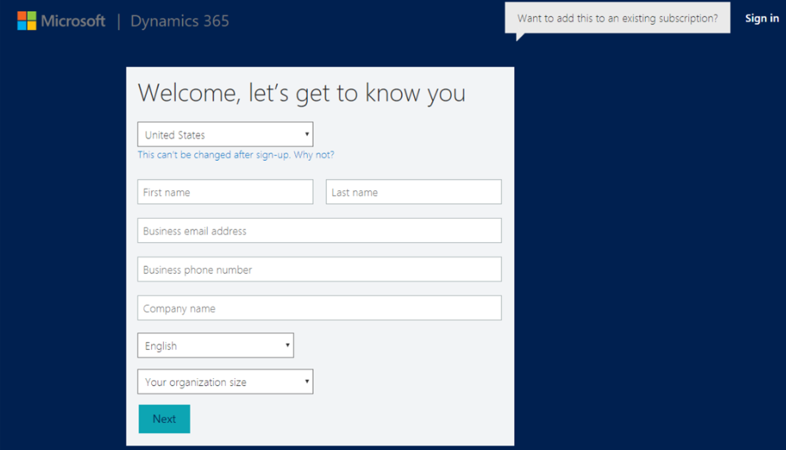

4. Enter your user ID information and click `Create my account`.

  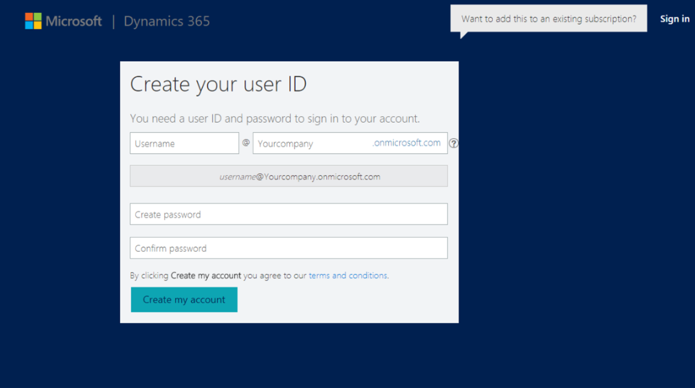

5. Lastly you'll have to confirm your identity using your phone, enter your phone number and click `Text me ->`.

  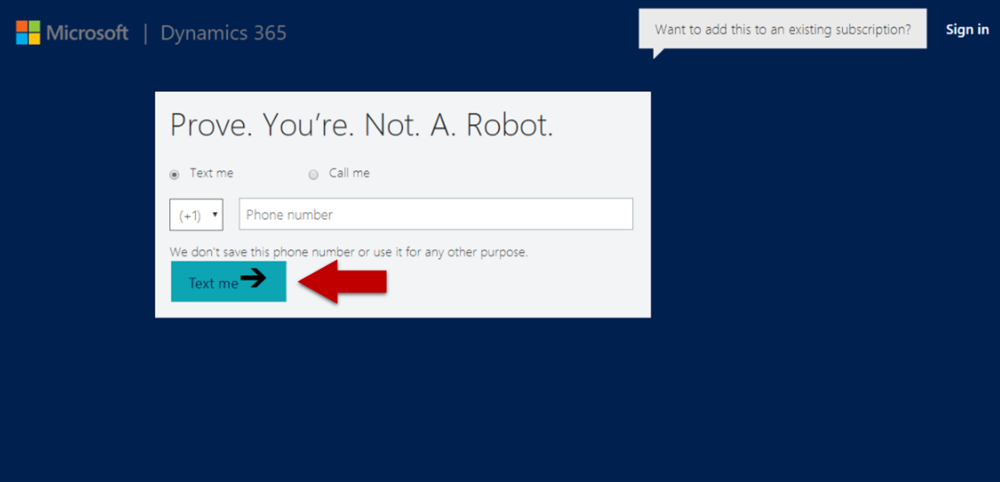

6. After phone authentication is complete, you'll be given some important URLS that you should note down while the signup is finishing. Once the signup is finished click the `Set up` that appears.

  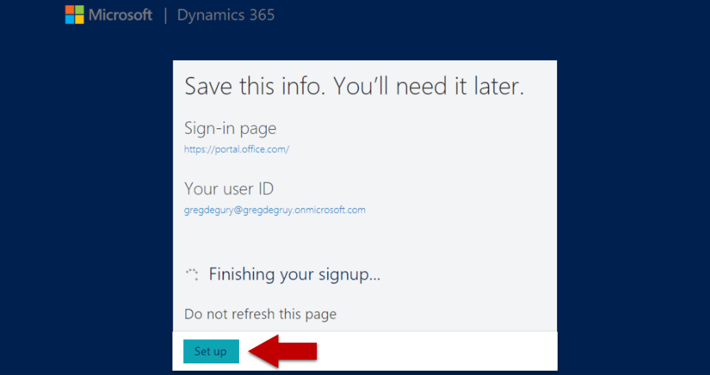

  > NOTE
  >
  > Keep the "Sign-in page" and "user ID" copied somewhere on your computer like a text file, you will need this information later.

7.	Now you should be on the Dynamics 365 FREE 30 Trial set up page.
  - `A` Field service should already be checked, if not make sure to click the check box.
  - `B` Click `Complete Setup`, A "Setting Up..." alert will appear.
  - `C` After the setup is complete you'll get another alert letting you know your Trial Organization will be ready soon!

    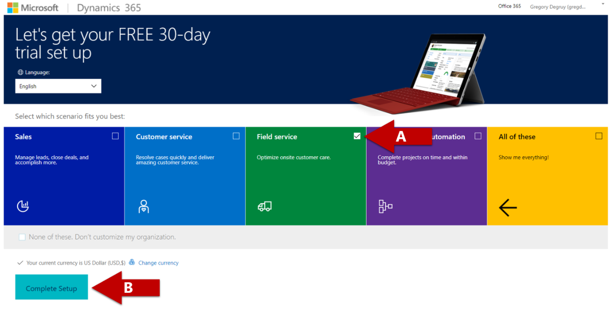

    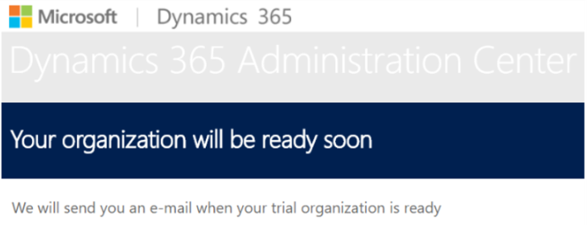

8. Head over the [Outlook mail website](https://outlook.office.com/owa/) and sign in with your business email address from step 3. Find the email from Microsoft Dynamics CRM Online and click the `Get Started` button from that email.

  

9. Welcome to Dynamics 365! No let's make sure your account has the right permissions going forward to complete the rest of the exercises we have in store.

  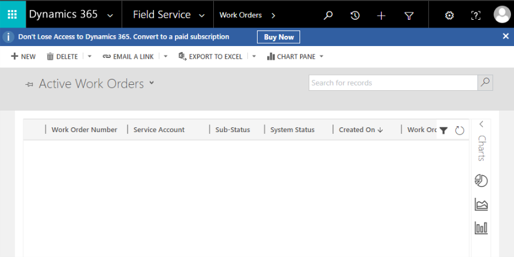

9.	We're going to do this by navigating through our organization's Site Map.
  - `A` Click the drop down arrow next to `Field service`
  - `B` Then click `Settings` to open our system and application settings
  - `C` Click `Security` under System settings

  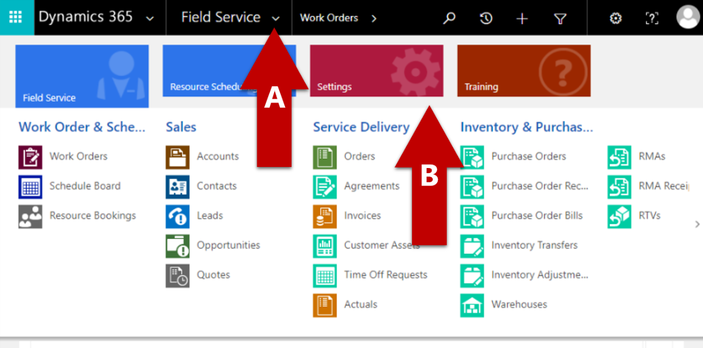

  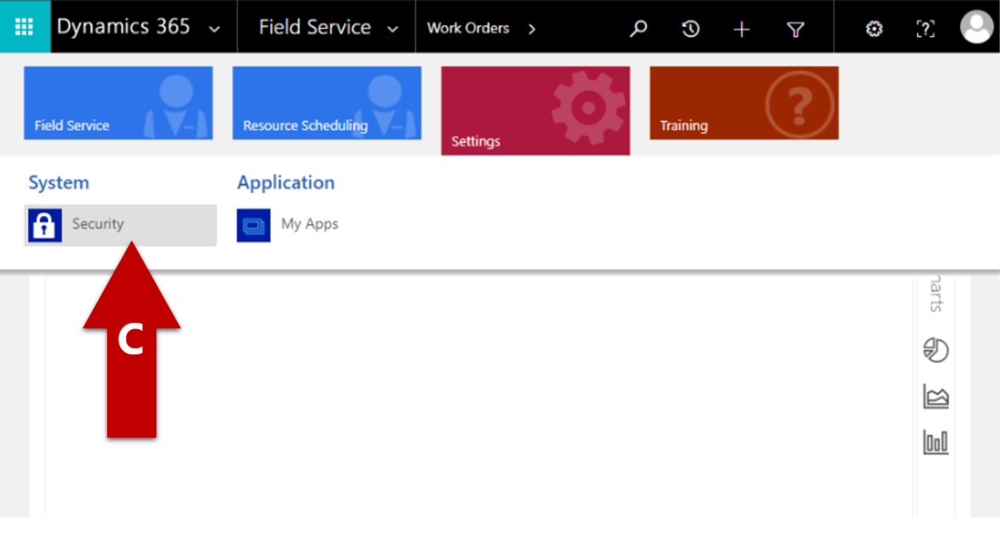

11.	On the Security Settings page Click Users.

  

12.	On the Enabled Users page:
  - `A` Click the check box next to your name
  - `B` Click `Promote to Admin` button
  - `C` Then click `OK` in the alert dialog that comes up

  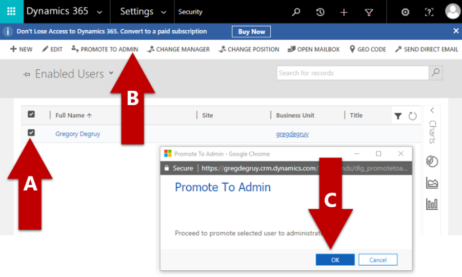

13.	Now that we've provisioned our own Dynamics 365 Online tenant with Field Service installed, we need to provision an Azure environment to host the IoT services for our solution. Keep all of your tabs open and use the same web browser for the following exercises.

> IMPORTANT
>
> Keep all of your tabs open and use the same web browser for the following exercises

## Exercise 2: Provision Azure Trial

1.	On your PC, browse to the [Azure free trail website](https://azure.microsoft.com/en-us/free/) [https://azure.microsoft.com/en-us/free/](https://azure.microsoft.com/en-us/free/) in the same web browser as you.

2.	Click `Start Free >` and sign In with your Dynamics Tenant Trial user ID created in Exercise 1 Step 4 if prompted to do so.

  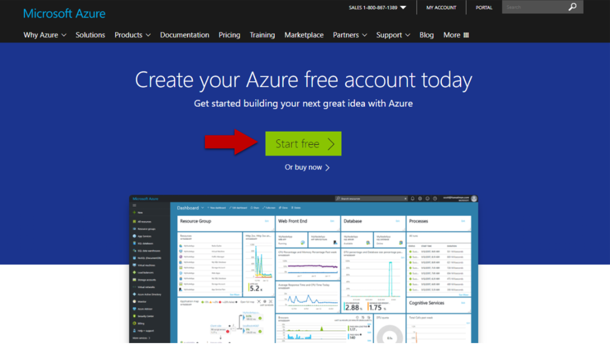

  > NOTE
  >
  > it will follow this format `Username@TenantName.Onmicrosoft.com`

3.	Fill out steps 1 through in Full through the free account sign up form  .

  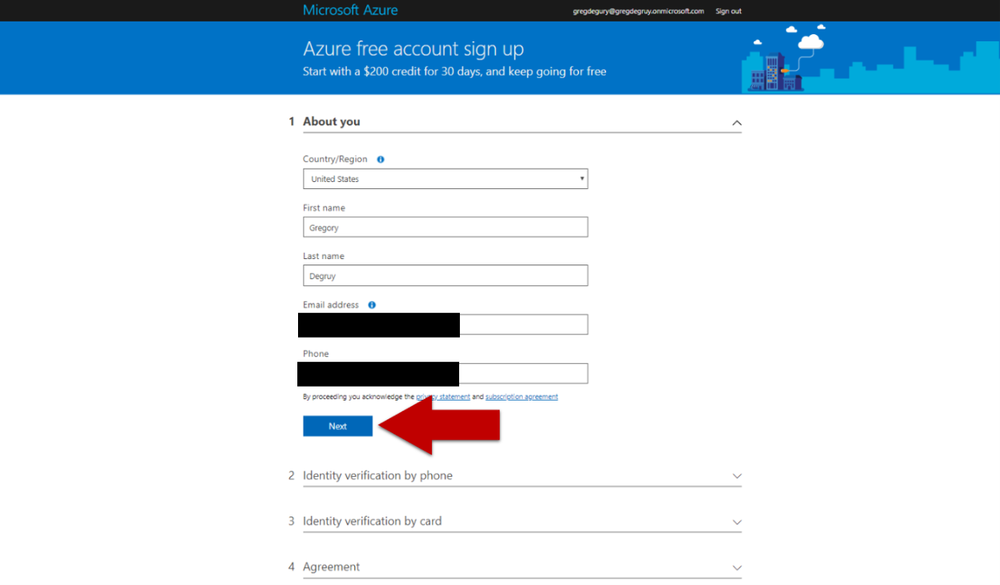

  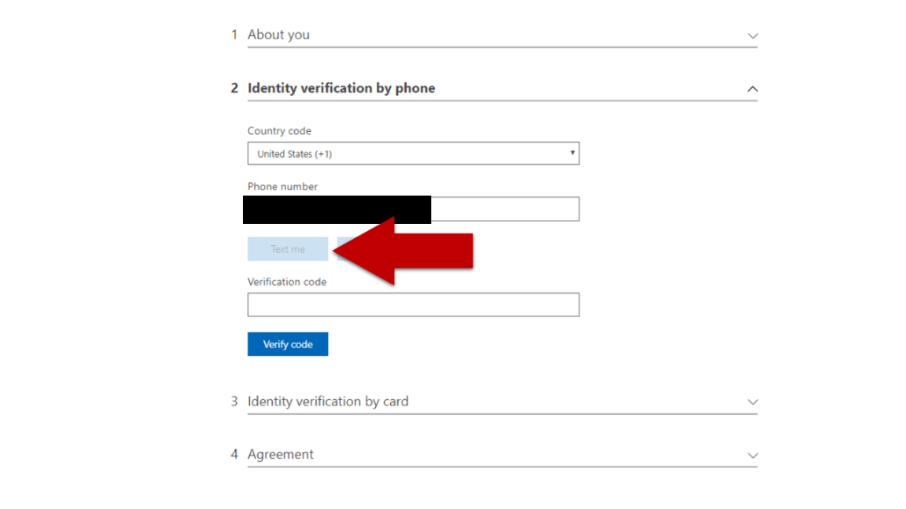

  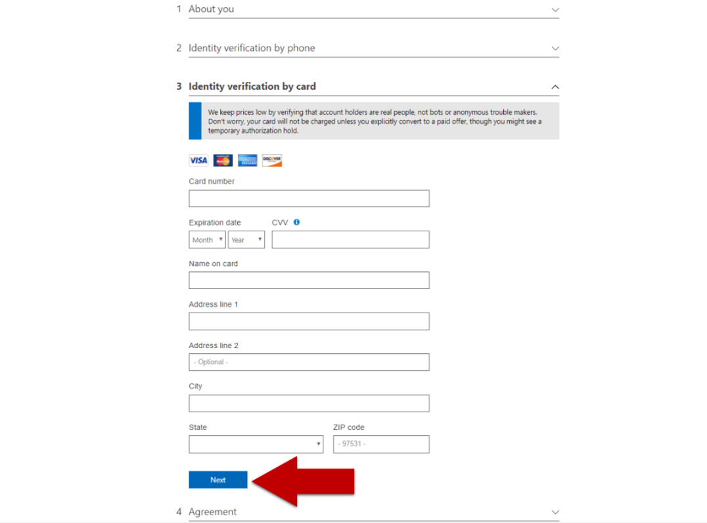

  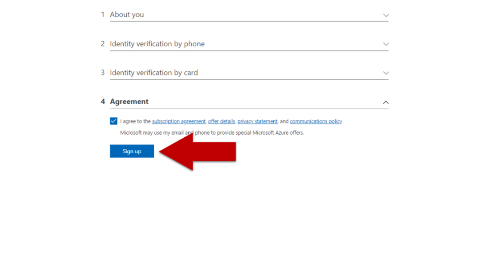

6.	After agreeing to the terms and clicking `Sign up`, you'll then be navigated to the Azure welcome page. Close this page and head to the [Azure portal](https://portal.azure.com/) at [https://portal.azure.com/](https://portal.azure.com/). You should the following landing page, choose maybe `Maybe later` for no on the alert window, free tours are fun and there's a time and place for everything, but not now.

  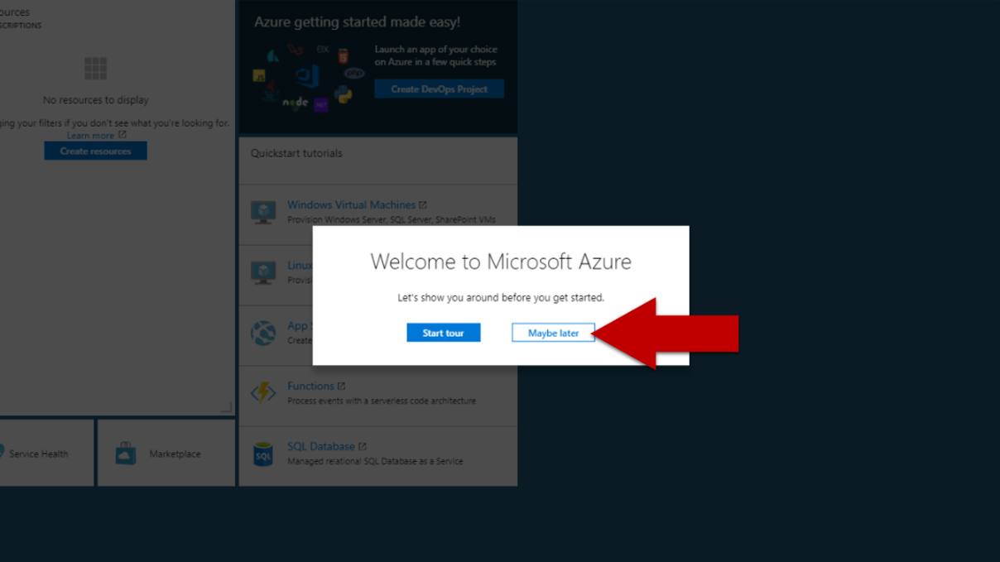

7. Now we have our Azure environment up and running! With both our Azure environment and Dynamics environment in place, all we need now is some IoT services to glue these platforms together.

## Exercise 3: Setup MX Chip

`{ TODO }`

## Exercise 4: Configure Connected Field Service (CFS)

1. On your computer, browse to AppSource here [https://appsource.microsoft.com/en-us/product/dynamics-365/mscrm.58666c7d-65ee-452d-8708-70b4d471d4c0](https://appsource.microsoft.com/en-us/product/dynamics-365/mscrm.58666c7d-65ee-452d-8708-70b4d471d4c0) and download the ["Connected Field Service Add-On"](https://appsource.microsoft.com/en-us/product/dynamics-365/mscrm.58666c7d-65ee-452d-8708-70b4d471d4c0) by clicking `GET IN NOW`.

  gregdegury@gregdegruy.onmicrosoft.com and https://gregdegruy.crm.dynamics.com/main.aspx

  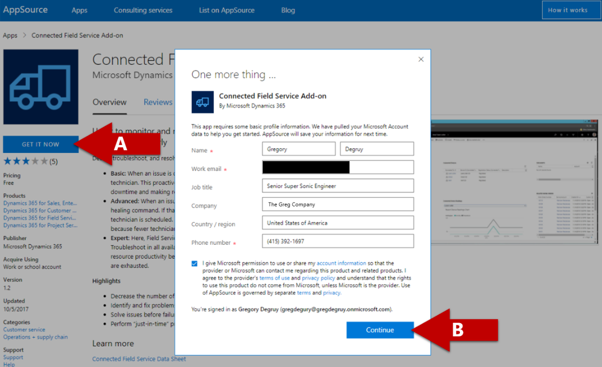

2. You should now see a prompt notifying you that you are being taken to Dynamics 365 to complete the process.

  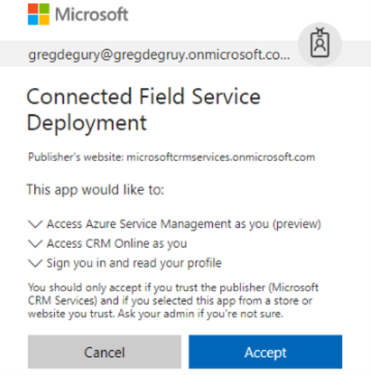

3. The first step in configuring your Connected Field Service environment is choosing the Dynamics 365 organization you want to install the Connected Field Service Add-On too.
  - `A` Your Dynamics 365 organization is auto selected for you
  - `B` Check off the two boxes to agree to the terms of use
  - `C` Click the `Agree` button

  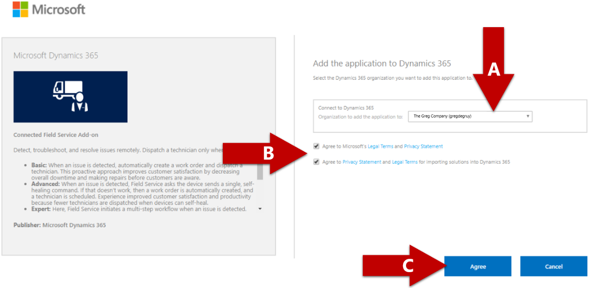

4.	Read over the Terms of service. Click `Next` when you're ready.

  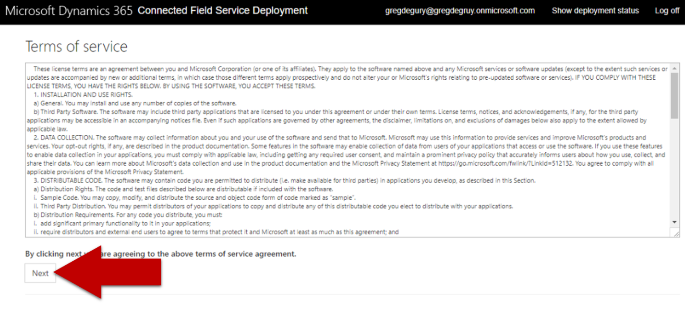

5.	Read over the Privacy statement. Click `Next` when you're ready.

  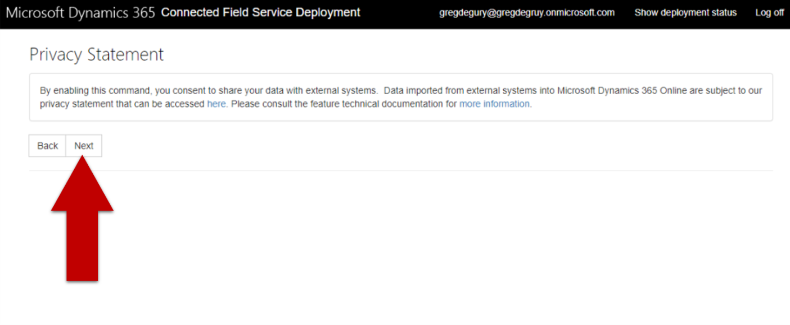

6.	Verify the Dynamics 365 subscription where the Internet of Things solution will be deployed is selected properly.
  - `A` Your Dynamics 365 organization is auto selected for you
  - `B` Click the `Next` button

  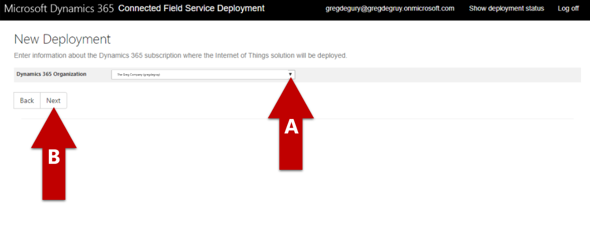

7.	Let's setup the Azure IoT connector services for your Dynamics organization.
  - `A` Your Azure Trial is auto selected for you and should say "Free Trial", this came from the work we did in Exercise 2.
  - `B` Choose `Create new` for our Resources
  - `C` Check Enable Power BI Integration. In my case I choose "gregdegruy" as my SQL Server Admin Login and... not about to give you my password silly :P.

  > NOTE
  >
  > Make sure you fill in **SQL Server Admin Login**, **SQL Password**, and **Confirm Password**

  - `D` Choose `Create new` for our Resource Group Selection
  - `E` Give your Resource Group a name and deployment region, in my case I called it "rg-connected-field-service" and choose "West US".

  > NOTE
  >
  > Make sure you choose both a **Resource Group Name** and **Deployment Region**

  - `F` Click the `Deploy` button

  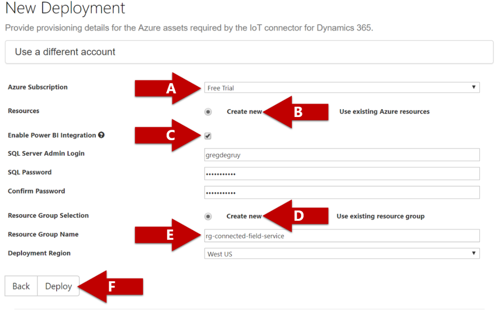

8.	Your Azure IoT connector services for your Dynamics organization are not automatically deploying for you! Starting with your Azure StorageAccount that currently has a InProgress Deployment Status, but will soon be at this Success and so will the other services that will slowly appear under Resource Type. This is going to take a while :/ around 25 minutes to be exact.

  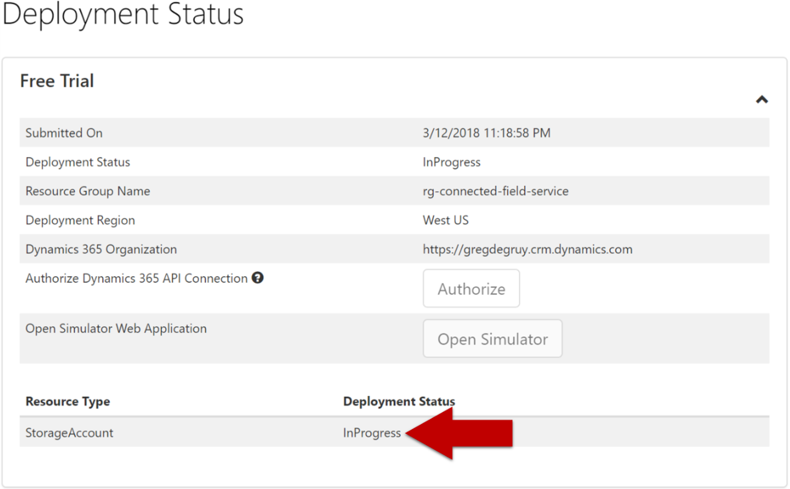

9.	Once deployment is completed, you'll notice all services will have a Success Deployment Status. You should now be able to click the Authorize button that will take you to your Azure Portal where we will complete our setup. Click the `Authorize` button.

  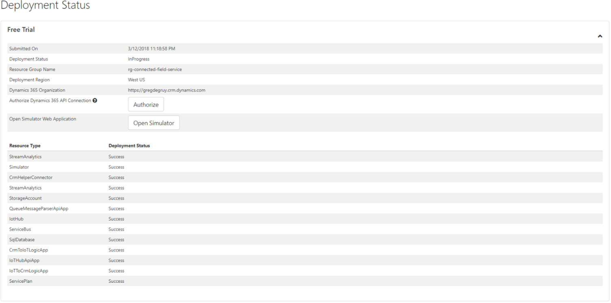

10.	The first windows you'll see in your Azure portal is for the dynamicscrmonline API Connection service. We need to authorize this API Connection service to connect to our Dynamics organization.
  - `A` "This connection is not authenticated" highlighted in yellow.

  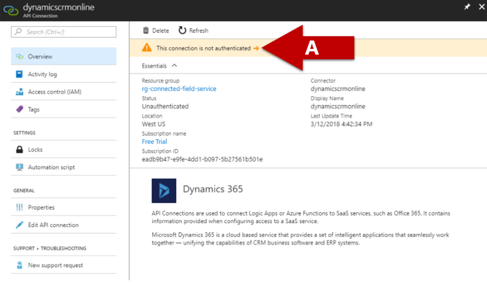  

  - `B` "This connection is not authenticated" highlighted in yellow.

  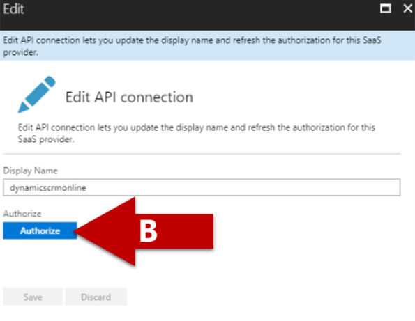  

  - `C` "This connection is not authenticated" highlighted in yellow.

  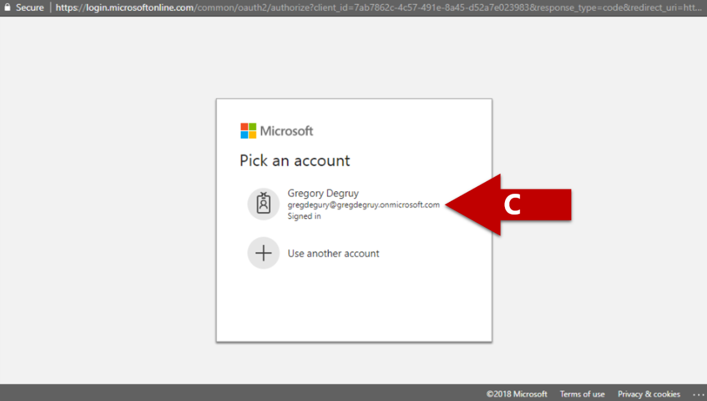  

  - `D` "This connection is not authenticated" highlighted in yellow.

  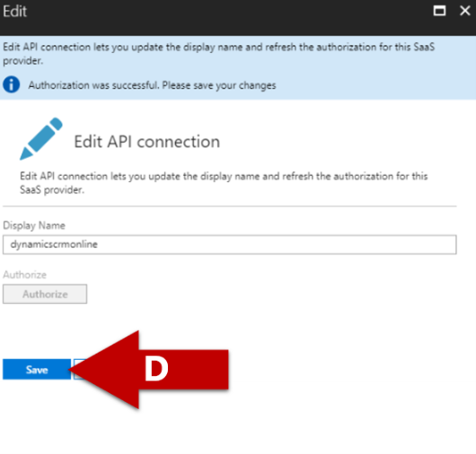  

11.	Now that we have an authorized API connection between Azure and Dynamics, we can.

    

12.	-

    

13.	-

    

14.	-

    

31.	Click the Authorize Button

32.	Enter your CRM Credentials (Username@OrganizationName.onmicrosoft.com)
33.	Click Sign In
34.	Click Save

35.	Click on the IoT Hub Item. It is normally named the same as your Resource Group with a GUID after it.

36.	Click on Share Access Policies

37.	Click + to Add a New Shared Access Policy

38.	Give your policy a name: “particle-iot-hub”
39.	 Give your new policy registry read, registry write, and device connect permissions

40.	Click Create to add the new shared access policy. It will take a few moments for Azure to create your new policy successfully.
41.	Click on the Access Policy Name you just created (particle-iot-hub)

42.	Copy the Primary Key to Notepad (Don’t share the Primary Key as it is like giving somebody the keys to your house. Without you home. And Top Shelf Liquor around.)

43.	Go back to the Resource Group
44.	About ¾ the way down the list of resources, there is a App Service that starts with Simulator + words words words words words words words
45.	Click on that resource
46.	Highlight the Resource Name
47.	In a new browser tab, paste the resource name followed by .azurewebsites.net
Like  Simulator.azurewebsites.net
48.
49.	So mine would become: SimulatorCFSHOLb594d2b5d25b48678337857fbe75a3f3.azurewebsites.net

## Exercise 5: Technical Decomposition
`{ will }`

## My Environment
`{ my dynamics and azure environment details }`

# References
- [Connected Field Service Add-On](https://appsource.microsoft.com/en-us/product/dynamics-365/mscrm.58666c7d-65ee-452d-8708-70b4d471d4c0)
- [Connected Field Service Architecture](https://docs.microsoft.com/en-us/dynamics365/customer-engagement/field-service/developer/connected-field-service-architecture)
- [GitHub icons](https://gist.github.com/rxaviers/7360908)
