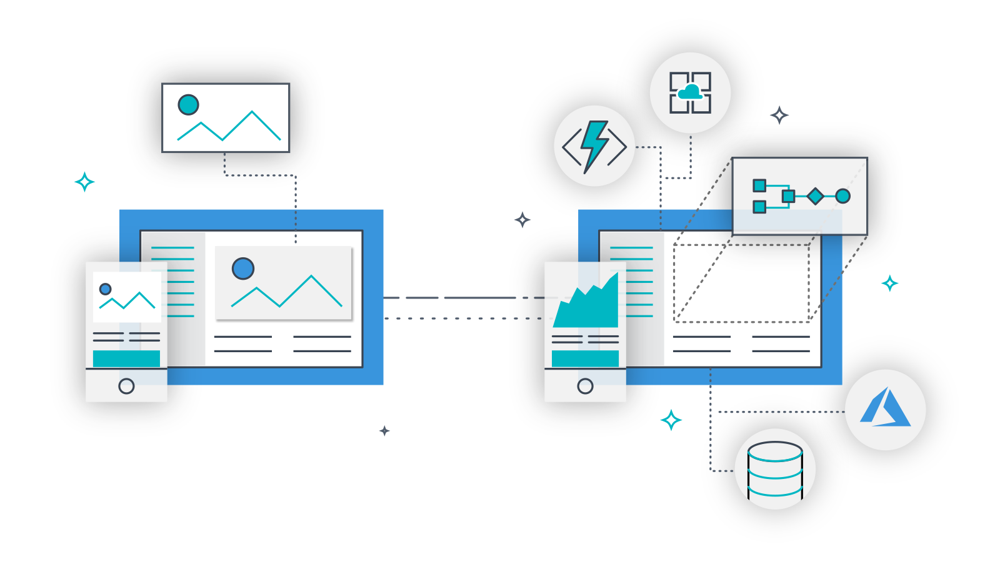

# Dynamics 365 Connected Field Service
---
The goal of this repo is to give you everything you need to set up a Connected Field Service (CFS) Environment. using both the first timer recommended [CFS Add-on](https://appsource.microsoft.com/en-us/product/dynamics-365/mscrm.58666c7d-65ee-452d-8708-70b4d471d4c0) and more advanced customizations through technical decomposition.

# Goals
| <p align="center"></p> [1. Provision Dynamics 365](Assets/HoloToolkit/Input/README.md) | <p align="center"></p> [2. Provision Azure Trail](Assets/HoloToolkit/Sharing/README.md) | <p align="center"></p> [3. Setup MX Chip](Assets/HoloToolkit/SpatialMapping/README.md) |
| :- | :- | :- |
| `{ todo }` | `{ todo }` | `{ todo }` |
| <p align="center"></p> [4. Setup MX Chip](Assets/HoloToolkit/SpatialMapping/README.md) | <p align="center"></p> [5. Technical decomposition](Assets/HoloToolkit/SpatialUnderstanding/README.md) | <p align="center"></p> [6. Something else](Assets/HoloToolkit/SpatialUnderstanding/README.md) |
| `{ todo }` | `{ todo }` | `{ todo }` |

## Finished Product
`{ .gif goes here }`


## Exercise 1: Provision Dynamics 365

1.	From a Web Browser on your computer, visit the [Dynamics 365 for Field Service home page](https://www.microsoft.com/en-us/dynamics365/field-service) and click the `START FREE >` button.

  

2. Start your digital transformation!
  - `A` Select the Field Service app if it is not selected already
  - `B` Click `Sign up here`

    

    > IMPORTANT
    >
    > Do not fill out work email and phone number and Do not click `GET STARTED >`

3. Next you'll be naviagted to provision your new Dynamics Trail. Fill out the general information about yourself and your company then click `Next`.

  

4. Enter your user ID information and click `Create my account`.

  

5. Lastly you'll have to confirm your identity using your phone, enter your phone number and click `Text me ->`.

  

6. After phone authentication is complete, you'll be given some important URLS that you should note down while the signup is finishing. Once the signup is finished click the `Set up` that appears.

  

  > NOTE
  >
  > Keep the "Sign-in page" and "user ID" copied somewhere on your computer like a text file, you will need this information later.

7.	Now you should be on the Dynamics 365 FREE 30 Trial set up page.
  - `A` Field service should already be checked, if not make sure to click the check box.
  - `B` Click `Complete Setup`, A "Setting Up..." alert will appear.
  - `C` After the setup is complete you'll get another alert letting you know your Trial Organization will be ready soon!

    

    

8. Head over the [Outlook mail website](https://outlook.office.com/owa/) and sign in with your business email address from step 3. Find the email from Microsoft Dynamics CRM Online and click the `Get Started` button from that email.

  

9. Welcome to Dynamics 365! No let's make sure your account has the right permissions going forward to complete the rest of the exercises we have in store.

  

9.	We're going to do this by navigating through our organization's Site Map.
  - `A` Click the drop down arrow next to `Field service`
  - `B` Then click `Settings` to open our system and application settings
  - `C` Click `Security` under System settings

  

  

11.	On the Security Settings page Click Users.

  

12.	On the Enabled Users page:
  - `A` Click the check box next to your name
  - `B` Click `Promote to Admin` button
  - `C` Then click `OK` in the alert dialog that comes up

  

13.	Now that we've provisioned our own Dynamics 365 Online tenant with Field Service installed, we need to provision an Azure environment to host the IoT services for our solution. Keep all of your tabs open and use the same web browser for the following exercises.

> IMPORTANT
>
> Keep all of your tabs open and use the same web browser for the following exercises


## Exercise 2: Provision Azure Trial


1.On your PC, browse to the [Azure free trail website](https://azure.microsoft.com/en-us/free/) [https://azure.microsoft.com/en-us/free/](https://azure.microsoft.com/en-us/free/) by opening a new tab in the same web browser as you configured Dynamics.

2. Click `Start Free >` and sign In with your Dynamics Tenant Trial user ID created in Exercise 1 Step 4 if prompted to do so.

  

  > NOTE
  >
  > it will follow this format `Username@TenantName.Onmicrosoft.com`

3. Fill out steps 1 through 4 in Full through the free account sign up form.

  

  

  

  

6. After agreeing to the terms and clicking `Sign up`, you'll then be navigated to the Azure welcome page. Close this page and head to the [Azure portal](https://portal.azure.com/) at [https://portal.azure.com/](https://portal.azure.com/). You should the following landing page, choose maybe `Maybe later` for no on the alert window, free tours are fun and there's a time and place for everything, but not now.

  

7. Now we have our Azure environment up and running! With both our Azure environment and Dynamics environment in place, all we need now is some IoT services to glue these platforms together.

## Exercise 3: Setup MX Chip

## Prepare your hardware

Hook up the hardware to your computer.

You need this hardware:

* DevKit board
* Micro-USB cable


To connect the DevKit to your computer:

1. Connect the USB end to your computer.
2. Connect the Micro-USB end to the DevKit.
3. The green LED for power confirms the connection.


## Configure Wi-Fi

IoT projects rely on internet connectivity. Use the following instructions to configure the DevKit to connect to Wi-Fi.

### Enter AP mode

Hold down button B, push and release the reset button, and then release button B. Your DevKit enters AP mode for configuring Wi-Fi. The screen displays the service set identifier (SSID) of the DevKit and the configuration portal IP address.

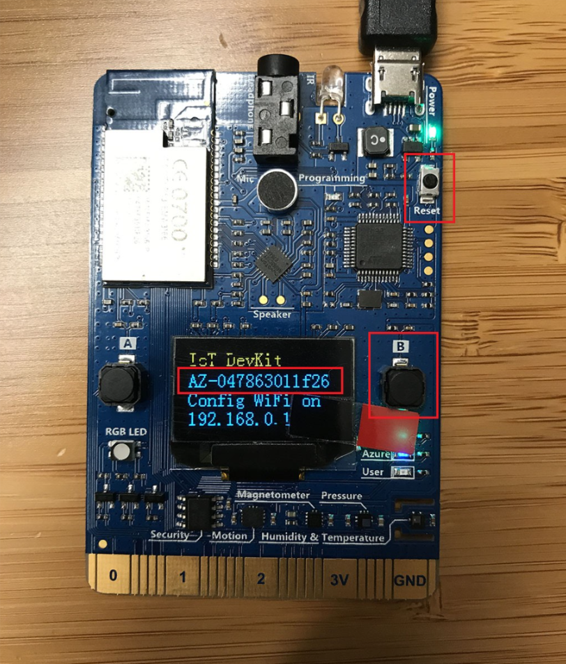

### Connect to DevKit AP

Now, use another Wi-Fi enabled device (computer or mobile phone) to connect to the DevKit SSID (highlighted in the previous image). Leave the password empty.

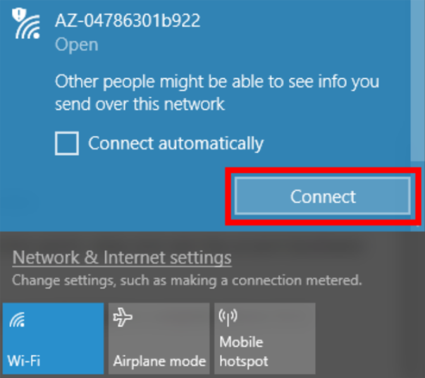

### Configure Wi-Fi for the DevKit

Open the IP address shown on the DevKit screen on your computer or mobile phone browser, select the Wi-Fi network that you want the DevKit to connect to, and then type the password. Select **Connect**.

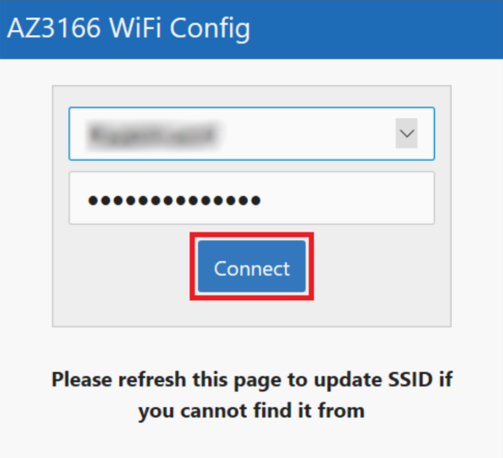

When the connection succeeds, the DevKit reboots in a few seconds. You then see the Wi-Fi name and IP address on the screen:


> [!NOTE] 
> The IP address displayed in the photo might not match the actual IP address assigned and displayed on the DevKit screen. This is normal, because Wi-Fi uses DHCP to dynamically assign IPs.

After Wi-Fi is configured, your credentials will persist on the device for that connection, even if the device is unplugged. For example, if you configure the DevKit for Wi-Fi in your home and then take the DevKit to the office, you will need to reconfigure AP mode (starting at the step in the "Enter AP Mode" section) to connect the DevKit to your office Wi-Fi. 

## Start using the DevKit

The default app running on the DevKit checks the latest version of the firmware and displays some sensor diagnosis data for you.

### Upgrade to the latest firmware

> [!NOTE] 
> Since v1.1, DevKit enables ST-SAFE in bootloader. You need to upgrade firmware if you are running under v1.1 in order to make it work probably.

If you need a firmware upgrade, the screen will show the current and latest firmware versions. To upgrade, follow the [Upgrade firmware](https://microsoft.github.io/azure-iot-developer-kit/docs/firmware-upgrading/) guide.


> [!NOTE] 
> This is a one-time effort. After you start developing on the DevKit and upload your app, the latest firmware will come with your app.

### Test various sensors

Press button B to test sensors. Continue pressing and releasing the button B to cycle through each sensor.


## Prepare the development environment

Now it's time to set up the development environment: tools and packages for you to build stunning IoT applications. You can choose the Windows or macOS version according to your operating system.

### Windows

We encourage you to use the installation package to prepare the development environment. If you encounter any problems, you can follow the [manual steps](https://microsoft.github.io/azure-iot-developer-kit/docs/installation/) to get it done.

#### Download the latest package

The .zip file that you download contains all the necessary tools and packages for DevKit development.

> [!div class="button"]
[Download](https://aka.ms/devkit/prod/installpackage/latest)

The .zip file contains the following tools and packages. If you already have some components installed, the script will detect and skip them.

* Node.js and Yarn: Runtime for the setup script and automated tasks.
* [Azure CLI 2.0 MSI](https://docs.microsoft.com//cli/azure/install-azure-cli#windows): Cross-platform command-line experience for managing Azure resources. The MSI contains dependent Python and pip.
* [Visual Studio Code](https://code.visualstudio.com/) (VS Code): Lightweight code editor for DevKit development.
* [Visual Studio Code extension for Arduino](https://marketplace.visualstudio.com/items?itemName=vsciot-vscode.vscode-arduino): Extension that enables Arduino development in Visual Studio Code.
* [Arduino IDE](https://www.arduino.cc/en/Main/Software): Tool that the extension for Arduino relies on.
* DevKit Board Package: Tool chains, libraries, and projects for the DevKit.
* ST-Link Utility: Essential tools and drivers.

#### Run the installation script

In Windows File Explorer, locate the .zip file and extract it. Find `install.cmd`, right-click it, and select **Run as administrator**.


During installation, you see the progress of each tool or package.


> [!NOTE] 
> Depending on your environment, sometimes you will get failure when installing Arduino IDE. In this case, you may try [install Arduino IDE individually](https://microsoft.github.io/azure-iot-developer-kit/docs/installation/#windows) and run install.cmd again. Otherwise, please follow the [manual steps](https://microsoft.github.io/azure-iot-developer-kit/docs/installation/#windows) to install all necessary tools and packages.

#### Install drivers

The VS Code for Arduino extension relies on the Arduino IDE. If this is the first time you are installing the Arduino IDE, you're prompted to install relevant drivers:


Installation should take around 10 minutes, depending on your internet speed. After the installation is complete, you should see Visual Studio Code and Arduino IDE shortcuts on your desktop.

> [!NOTE] 
> Occasionally, when you start VS Code, you're prompted with an error that it cannot find the Arduino IDE or related board package. To solve it, close VS Code and restart the Arduino IDE. VS Code should then locate the Arduino IDE path correctly.

### macOS

We encourage you to use one-click installation experience to prepare the development environment. If you encounter any problems, you can follow the [manual steps](https://microsoft.github.io/azure-iot-developer-kit/docs/installation/) to get it done.

#### Install Homebrew

> [!NOTE] 
> If you have installed Homebrew, you can skip this step.

Follow the [Homebrew installation instructions](https://docs.brew.sh/Installation.html) to install it.

#### Download the latest package
The .zip file that you download contains all the necessary tools and packages for DevKit development.

> [!div class="button"]
[Download](https://aka.ms/devkit/prod/installpackage/mac/latest)

The .zip file contains the following tools and packages. If you already have some components installed, the script will detect and skip them.

* Node.js and Yarn: Runtime for the setup script and automated tasks.
* [Azure CLI 2.0](https://docs.microsoft.com/cli/azure/install-azure-cli?view=azure-cli-latest#a-namemacosinstall-on-macos): Cross-platform command-line experience for managing Azure resources.
* [Visual Studio Code](https://code.visualstudio.com/) (VS Code): Lightweight code editor for DevKit development.
* [Visual Studio Code extension for Arduino](https://marketplace.visualstudio.com/items?itemName=vsciot-vscode.vscode-arduino): Extension that enables Arduino development in Visual Studio Code.
* [Arduino IDE](https://www.arduino.cc/en/Main/Software): Tool that the extension for Arduino relies on.
* DevKit Board Package: Tool chains, libraries, and projects for the DevKit.
* ST-Link Utility: Essential tools and drivers.

#### Run the installation script

In the Finder, locate the .zip and extract it:


Launch Terminal app, locate the folder you extract .zip file and run:

```bash
./install.sh
```


> [!NOTE] 
> If you meet Homebrew permission error, run `brew doctor` to get it fixed. Check [FAQ](https://microsoft.github.io/azure-iot-developer-kit/docs/faq/#homebrew-permission-error-on-macos) for more details.

You now have all the necessary tools and packages installed for macOS.


## Open the project folder

### Start VS Code

Make sure your DevKit is not connected. Start VS Code first and connect the DevKit to your computer. VS Code automatically finds the DevKit and opens an introduction page:


> [!NOTE] 
> Occasionally, when you start VS Code, you're prompted with an error that it cannot find the Arduino IDE or related board package. Close VS Code and restart the Arduino IDE. VS Code should then locate the Arduino IDE path correctly.


### Open the Arduino Examples folder

On the **Arduino Examples** tab, browse to **Examples for MXCHIP AZ3166** > **AzureIoT**, and select **GetStarted**.


If you happen to close the pane, you can reopen it. Use `Ctrl+Shift+P` (macOS: `Cmd+Shift+P`) to open the command palette, type **Arduino**, and then find and select **Arduino: Examples**.

## Provision Azure services

In the solution window, run your task through `Ctrl+P` (macOS: `Cmd+P`) by entering `task cloud-provision`.

In the VS Code terminal, an interactive command line guides you through provisioning the required Azure services:


## Build and upload the Arduino sketch

### Windows

1. Use `Ctrl+P` to run `task device-upload`.
2. The terminal prompts you to enter configuration mode. To do so, hold down button A, then push and release the reset button. The screen displays the DevKit id and 'Configuration'.

This is to set the connection string that retrieves from `task cloud-provision` step.

Then VS Code starts verifying and uploading the Arduino sketch:


The DevKit reboots and starts running the code.

> [!NOTE] 
> Occasionally, you get error "Error: AZ3166: Unknown package". This is due to the board package index is not refreshed. Check this [FAQ steps](https://microsoft.github.io/azure-iot-developer-kit/docs/faq/) to solve it.

### macOS

1. Put DevKit into configuration mode:
  Hold down button A, then push and release the reset button. The screen displays 'Configuration'.
2. Use `Cmd+P` to run `task device-upload`.

This is to set the connection string that retrieves from `task cloud-provision` step.

Then VS Code starts verifying and uploading the Arduino sketch:


The DevKit reboots and starts running the code.

> [!NOTE] 
> Occasionally, you get error "Error: AZ3166: Unknown package". This is due to the board package index is not refreshed. Check this [FAQ steps](https://microsoft.github.io/azure-iot-developer-kit/docs/faq/) to solve it.


## Test the project

In VS Code, following these steps to open and set up the Serial Monitor:

1. Click the `COM[X]` word on the status bar to set the right COM port with `STMicroelectronics`:
  

2. Click power plug icon on the status bar to open the Serial Monitor:
  

3. On the status bar, click the number that represents the Baud Rate and set to `115200`:
  

The sample application is running successfully when you see the following results:

* The Serial Monitor displays the same information as the content in the screenshot below.
* The LED on MXChip IoT DevKit is blinking.


## Problems and feedback

If you encounter problems, you can find [FAQs](https://microsoft.github.io/azure-iot-developer-kit/docs/faq/). You can also give us feedback by leaving a comment on this page.

## Next steps

You have successfully connected an MXChip IoT DevKit to your IoT hub, and you have sent the captured sensor data to your IoT hub.


## Exercise 4: Configure Connected Field Service (CFS)

1. On your computer, browse to AppSource here [https://appsource.microsoft.com/en-us/product/dynamics-365/mscrm.58666c7d-65ee-452d-8708-70b4d471d4c0](https://appsource.microsoft.com/en-us/product/dynamics-365/mscrm.58666c7d-65ee-452d-8708-70b4d471d4c0) and download the ["Connected Field Service Add-On"](https://appsource.microsoft.com/en-us/product/dynamics-365/mscrm.58666c7d-65ee-452d-8708-70b4d471d4c0) by clicking `GET IN NOW`.

  gregdegury@gregdegruy.onmicrosoft.com and https://gregdegruy.crm.dynamics.com/main.aspx

  

2. You should now see a prompt notifying you that you are being taken to Dynamics 365 to complete the process.

  

3. The first step in configuring your Connected Field Service environment is choosing the Dynamics 365 organization you want to install the Connected Field Service Add-On too.
  - `A` Your Dynamics 365 organization is auto selected for you
  - `B` Check off the two boxes to agree to the terms of use
  - `C` Click the `Agree` button

  

4. Read over the Terms of service. Click `Next` when you're ready.

  

5. Read over the Privacy statement. Click `Next` when you're ready.

  

6. Verify the Dynamics 365 subscription where the Internet of Things solution will be deployed is selected properly.
  - `A` Your Dynamics 365 organization is auto selected for you
  - `B` Click the `Next` button

  

7.	Let's setup the Azure IoT connector services for your Dynamics organization.
  - `A` Your Azure Trial is auto selected for you and should say "Free Trial", this came from the work we did in Exercise 2.
  - `B` Choose `Create new` for our Resources
  - `C` Check Enable Power BI Integration. In my case I choose "gregdegruy" as my SQL Server Admin Login and... not about to give you my password silly :P.

  > NOTE
  >
  > Make sure you fill in **SQL Server Admin Login**, **SQL Password**, and **Confirm Password**

  - `D` Choose `Create new` for our Resource Group Selection
  - `E` Give your Resource Group a name and deployment region, in my case I called it "rg-connected-field-service" and choose "West US".

  > NOTE
  >
  > Make sure you choose both a **Resource Group Name** and **Deployment Region**

  - `F` Click the `Deploy` button

  

8. Your Azure IoT connector services for your Dynamics organization are not automatically deploying for you! Starting with your Azure StorageAccount that currently has a InProgress Deployment Status, but will soon be at this Success and so will the other services that will slowly appear under Resource Type. This is going to take a while :/ around 25 minutes to be exact.

  

9.	Once deployment is completed, you'll notice all services will have a Success Deployment Status. You should now be able to click the Authorize button that will take you to your Azure Portal where we will complete our setup. Click the `Authorize` button.

  

10.	The first windows you'll see in your Azure portal is for the dynamicscrmonline API Connection service. We need to authorize this API Connection service to connect to our Dynamics organization.
  - `A` Click "This connection is not authenticated" highlighted in yellow.

    

  - `B` Give your connection a name and click `Authorize`

    

  - `C` A Window will open for you to pick your Microsoft account login. We created this login in Exercise 1 step 6, only one login should be shown show so select it.

    

  - `D` The window will close and you'll now have the option to save your API connection information, click `Save`.

    

11.	Now that we have an authorized API connection between Azure and Dynamics, we can start configuring our IoT Hub. This IoT Hub serves as our management service for the IoT device. Click on `Resource Groups` from the left menu.

    

12.	This will bring you to the resource group selection list. We created this resource group in Exercise 3 step 7 and contains all of the IoT connector service we'll be using. Click on `rg-connected-field-service`.

  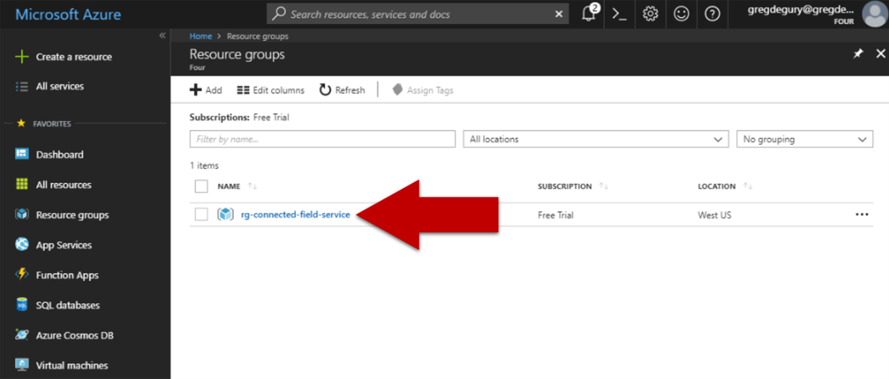  

13.	Click on your IoT Hub. It is named the same as your Resource Group with a long list of letters and numbers in the form of a GUID, in my case it's called `rgconnectedfieldservice8e3aca9cda474acd82c08f5a`.

  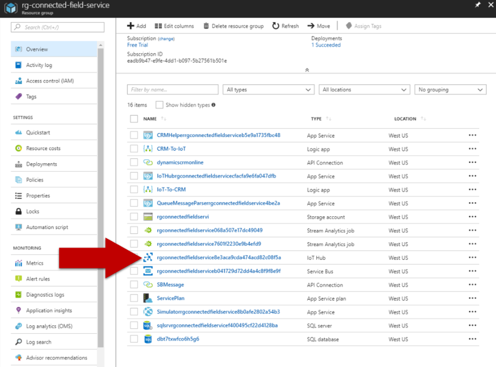  

14.	Now we need to add a Shared access policy to create a connection between our IoT Hub and Dynamics.
  - `A` Click "Shared access policy" from the IoT Hub menu.
  - `B` Click "+ Add" at the very top of the Shares access policy list.

  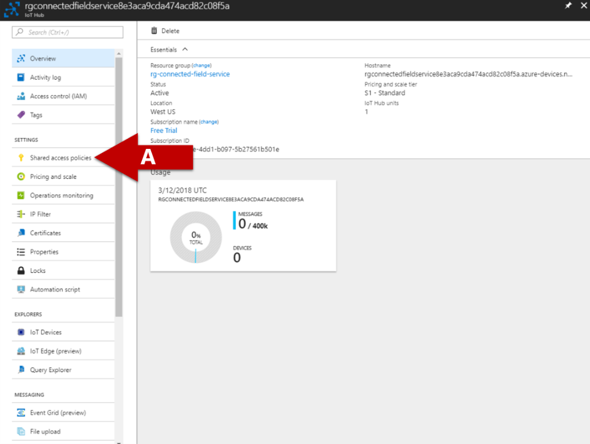  
  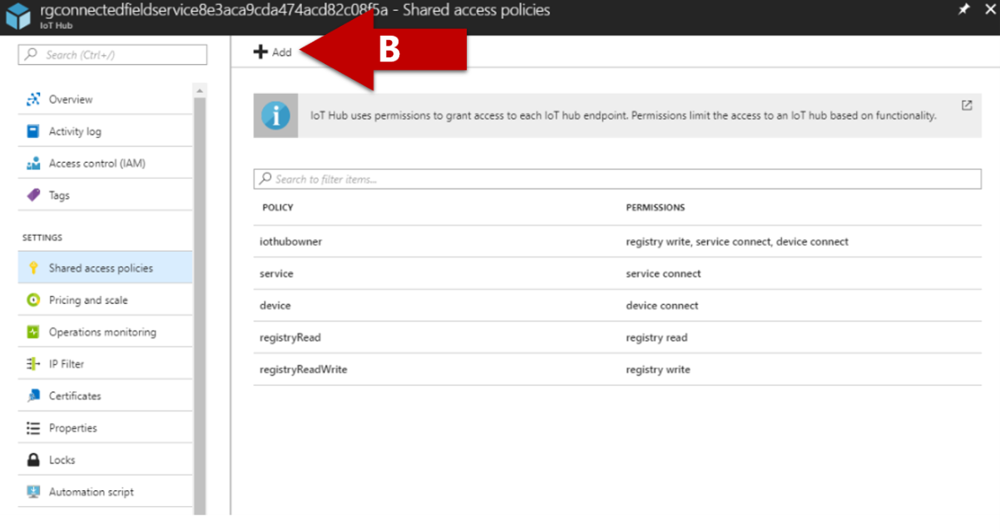  

15.	Then give the Shared access policy the permissions it needs to communicate with Dynamics.
  - `A` Give your policy a name, I called mine "dynamics-iot-hub"
  - `B` Select the `Registry read`, `Registry write`, and `Device connect` permissions
  - `C` Click the `Create` button

  > NOTE
  >
  > Make sure you select all 3 permissions **Registry read**, **Registry write**, and **Device connect** before creating the policy.

  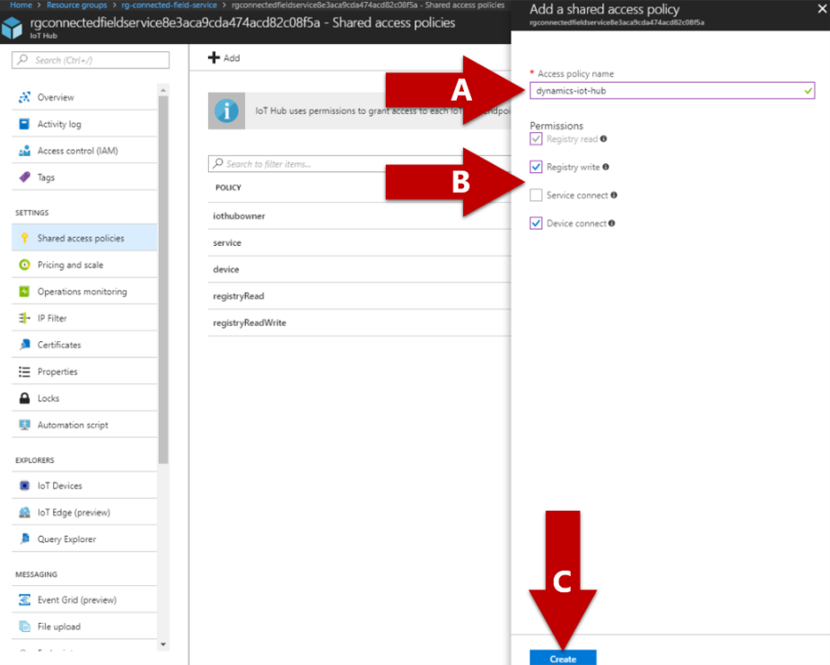  

16.	Once created, the shared access policy will provide 4 keys to you. The one we will need going forward is the `Primary Key`, click the copy button for the primary key and save it in Notepad. Notepad can be open by clicking the `A` Cortana button next to the Windows icon and typing in Notepad. It will be the first app on the list that you can then `B` click on.

  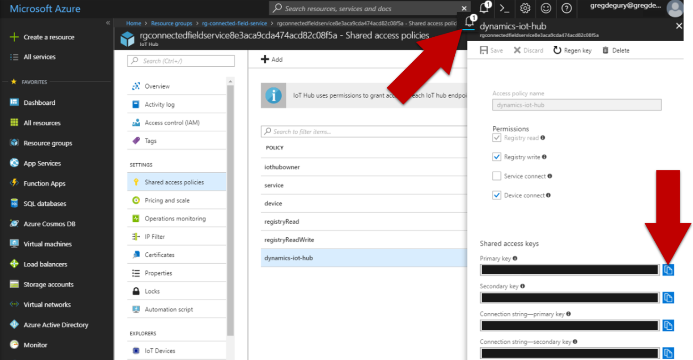  
  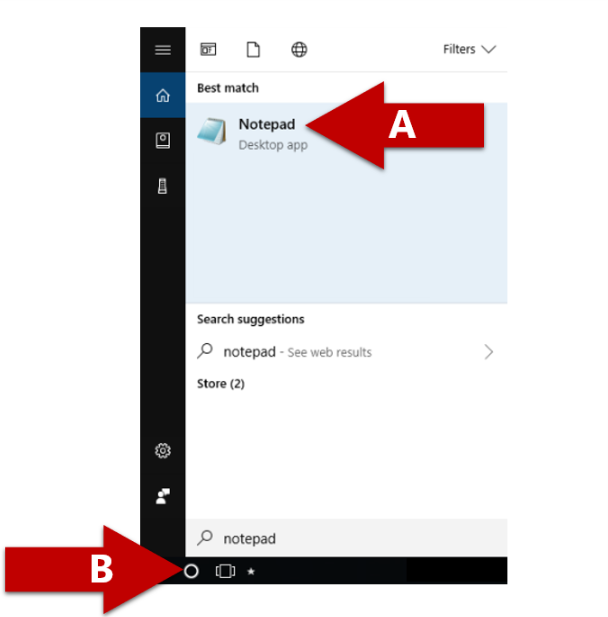

17.	Now that we have SAS key saved, we can head to our device simulator. This simulator is a web app that we can use to see real time IoT device telemetry. Click on `Resource Groups` from the left menu.

  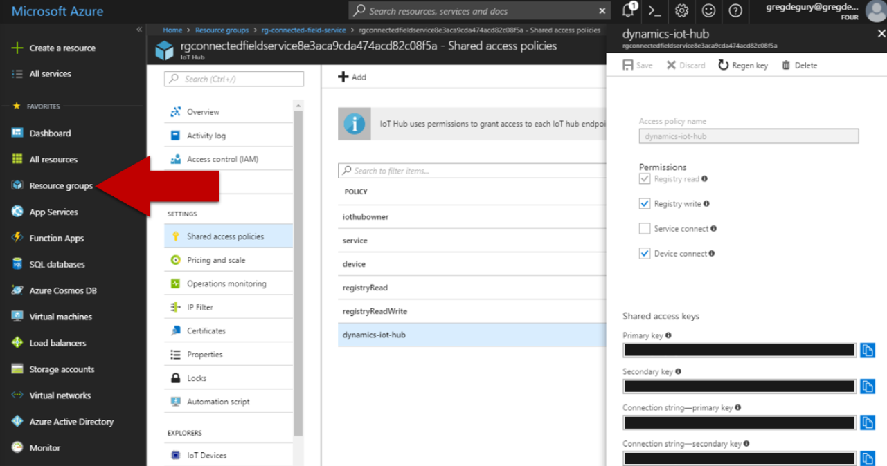  

18.	This will bring you to the resource group selection list. We created this resource group in Exercise 3 step 7 and contains all of the App service we'll be using for our simulator. Click on `rg-connected-field-service`.

    

19.	Click on your Simulator App Service. It is named Simulator followed by the same name as your Resource Group with a long list of letters and numbers in the form of a GUID, in my case it's called `Simulatorrgconnectedfieldservice8b0afe2802a54b3`.

  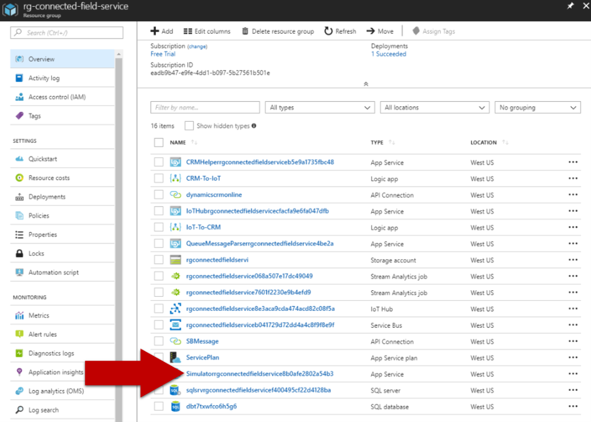  

20. After you click on your Simulator App Service, you'll be brought to the main page for your App Service. Move your mouse to the right of the URL link, a copy button will appear. Click the copy button to copy the URL. In a new browser tab, paste the URL.

  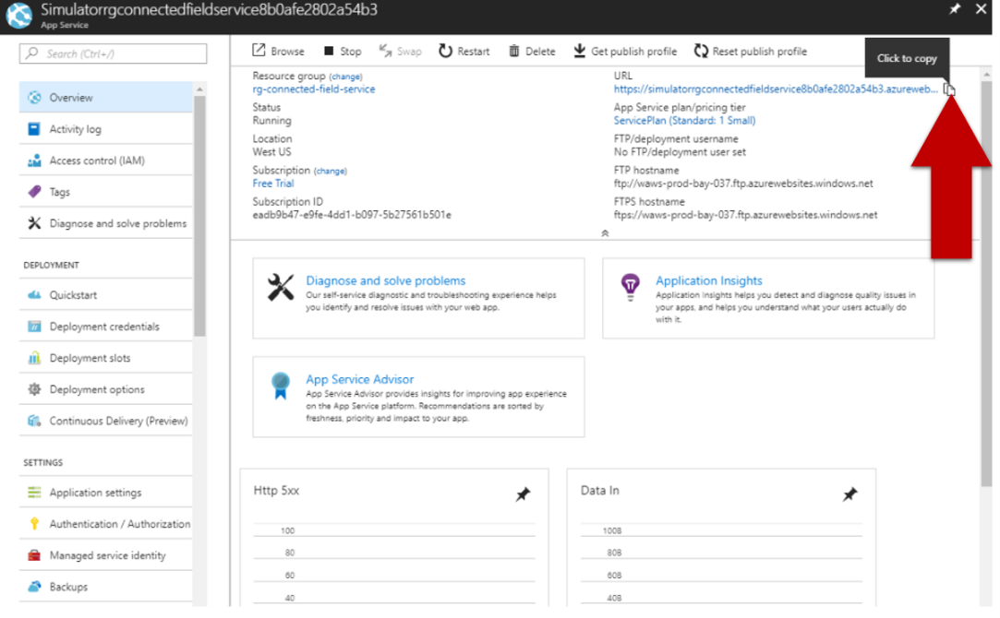

21. You should now be on your IoT device simulator website.

  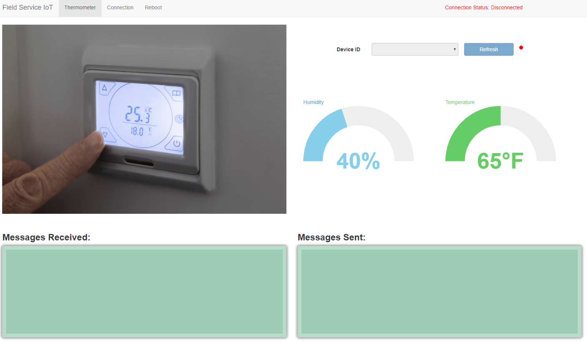  

## Exercise 5
`{ todo }`

## Technical Decomposition
`{ todo }`

## How do we define Field Service
`{ todo }`

## Functional Use Cases for CFS
`{ todo }`  

## Practical Use Cases for CFS
`{ todo }`

## My Environment
`{ todo }`

# References
- [Business Application Platform](https://dynamics.microsoft.com/en-us/business-application-platform/)
- [Connected Field Service Add-On](https://appsource.microsoft.com/en-us/product/dynamics-365/mscrm.58666c7d-65ee-452d-8708-70b4d471d4c0)
- [Connected Field Service Architecture](https://docs.microsoft.com/en-us/dynamics365/customer-engagement/field-service/developer/connected-field-service-architecture)
- [MX Chip with VS Code Setup](https://docs.microsoft.com/en-us/azure/iot-hub/iot-hub-arduino-iot-devkit-az3166-get-started)
- [GitHub icons](https://gist.github.com/rxaviers/7360908)
